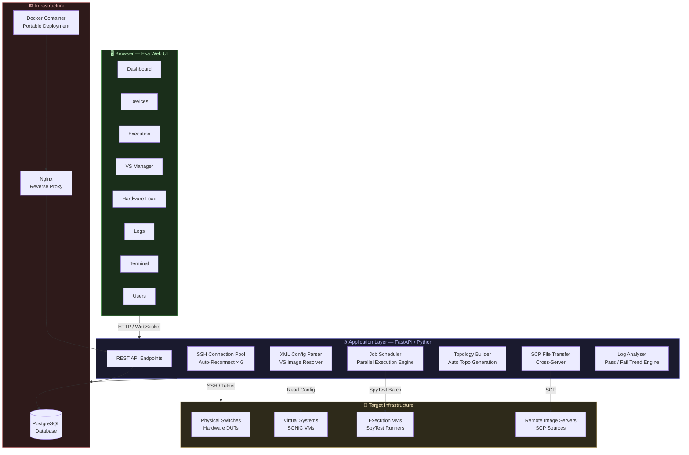
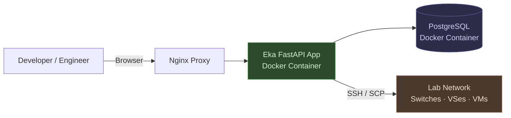

# EKA Automation Platform

> *"Eka" — Sanskrit for **One**. One platform. One click. Everything done.*

---

## Table of Contents

1. [The Problem — Why We Built Eka](#the-problem)
2. [What Is Eka?](#what-is-eka)
3. [The Journey — Challenges & Evolution](#the-journey)
4. [Resilience & Intelligence — What Makes Eka Robust](#resilience--intelligence)
5. [How Eka Works — End-to-End Workflow](#how-eka-works)
6. [Architecture — High-Level Design](#architecture)
7. [Platform Modules — Deep Dive](#platform-modules)
8. [Summary](#summary)

---

## The Problem

### 🔥 Pain Points That Sparked Innovation

Before Eka, our engineering teams faced a recurring gauntlet of manual, error-prone processes that consumed hours of valuable engineering time every single day:

| Challenge | Impact |
|---|---|
| Loading new firmware images onto Virtual Systems (VSes) required executing a precise sequence of multi-step commands across multiple folders — a single missed step corrupted the entire upload | Hours lost to re-imaging; team confusion over folder structures and command order |
| Executing regression scripts was a strictly sequential process — one script had to finish before the next could begin | Long overnight wait times; inefficient resource utilization |
| No unified execution report existed — pass/fail status had to be pieced together from raw log files scattered across VMs | Poor visibility; inability to track test-case stability trends over time |
| Hardware re-imaging demanded deep institutional knowledge of bootloader steps and device states | Steep learning curve; risk of bricked hardware if steps were skipped or misordered |

> **The verdict was clear:** The team needed a unified, intelligent automation layer that could abstract away all this operational complexity and replace it with a single, reliable interface.

---

## What Is Eka?

**Eka** is a full-stack, web-based network automation platform built to eliminate manual toil in the areas of firmware management, regression testing, and infrastructure resource orchestration.

Whether the goal is to:
- Flash a physical switch with a new SONiC build
- Upgrade a fleet of Virtual Systems simultaneously
- Run hundreds of test scripts concurrently across multiple VMs
- Monitor live execution health and analyze test-case stability over time

**— Eka handles it all with a single click.**

The name is drawn from the Sanskrit word *एक* (Eka), meaning **One** — a deliberate reflection of the platform's core promise: *one tool, one workflow, one source of truth* for your entire automation pipeline.

---

## The Journey

### Evolution of the Platform

Eka was not built in a vacuum — it was shaped by real engineering constraints and scaled thoughtfully as adoption grew.

```
Phase 1 ──────────────────────────────────────────────────────────► Today
  │                    │                        │
  ▼                    ▼                        ▼
SQLite            PostgreSQL               Docker Image
(Small team,      (Cross-team              (Portable, server-
 local use)        expansion)               agnostic deployment)
```

#### **Phase 1 — Proof of Concept**
Eka started as a standalone application backed by **SQLite**, designed for the automation team's immediate needs. Simplicity and speed-to-value were the priorities.

#### **Phase 2 — Cross-Team Adoption**
As usage grew beyond the original team, the platform was migrated to **PostgreSQL** to support a larger, concurrent user base with proper transactional integrity, role management, and data durability.

#### **Phase 3 — Containerization**
Recognizing the need for portability across lab environments and servers, the entire application was packaged as a **Docker image**. This eliminated environment-specific configuration drift and made deploying Eka on any server as simple as `docker compose up`.

---

## Resilience & Intelligence

### What Makes Eka Robust

Eka is engineered for the realities of lab environments — where network instability, device reboots, and long-running operations are everyday occurrences. The platform is designed to be **self-healing** and **context-aware**.

#### 🔄 Automatic SSH Reconnection
If a device loses its SSH connection mid-operation, Eka **automatically retries up to 6 times** before surfacing an alert. This ensures long-running processes — such as firmware flashing or script execution — are never silently killed by transient network blips.

#### ♻️ Smart Connection Pool Management
When a device is removed from the platform, Eka **gracefully releases its SSH connection** back to the pool, ensuring no leaked sessions or resource exhaustion over time.

#### 🗂️ XML-Driven VS Configuration
The VS Manager is entirely metadata-driven. When a Virtual System is selected, Eka automatically **reads the associated XML configuration file**, extracts the active image path, removes the outdated image, and copies the new image — using the exact filename prescribed in the XML. No manual path-hunting required.

#### 📋 Intelligent Image Renaming for VS Spin-Up
When spinning up a new Virtual System, Eka parses the configuration, identifies the required image, and **renames files to match the expected naming convention** before initiating the spin-up sequence — ensuring a clean, deterministic boot every time.

---

## How Eka Works

### End-to-End Workflow

#### 🖥️ Hardware Imaging Pipeline

```
User provides: Device IP + Login Credentials + Image Path
         │
         ▼
    Eka detects current device state
    (bare metal / existing OS / ONIE discovery loop)
         │
         ▼
    Interrupts bootloader → Transfers new image via SCP
         │
         ▼
    Removes old image → Installs new firmware cleanly
         │
         ▼
    Device is ready with new build ✅
```

No knowledge of bootloader commands, folder structures, or multi-step ONIE procedures is required. Eka handles every step internally.

---

#### 🌐 Virtual System (VS) Management Pipeline

```
User connects to hypervisor server
         │
         ▼
    Eka lists all running VSes and VMs on the server
         │
         ├──► Start / Stop / Pause any VS
         │
         └──► Upgrade VS with new image
                    │
                    ▼
              Image on remote server? → Eka SCP-copies it automatically
                    │
                    ▼
              Single VS or batch of VSes? → Both supported simultaneously ✅
```

The built-in **SCP implementation** allows Eka to pull firmware images from any reachable server on the network — no manual file staging needed.

---

#### ⚡ Script Execution & Regression Pipeline

```
User selects: VM + Scripts + DUTs (Devices Under Test)
         │
         ▼
    Eka auto-generates a master topology file (topo)
         │
         ▼
    Executes scripts concurrently based on device availability
         │
         ├──► Need latest scripts? → Git Pull from within Eka
         │
         ├──► Multiple topologies & script sets? → Job-based execution
         │         (Run 2, 3, 4… N parallel jobs simultaneously)
         │
         ├──► Scheduled run? → Built-in time scheduler
         │         (Once, daily, or custom cron)
         │
         └──► Results: Live dashboard + HTML report + Log analysis
                    │
                    ├── Pass/Fail per test case (last 5 runs trend)
                    ├── Live board: jobs in flight
                    └── Cross-job log comparison (failure diff) ✅
```

---

## Architecture

### High-Level System Design



---

### Deployment Model



---

## Platform Modules

### 📊 Dashboard

The command-and-control nerve centre of Eka. At a glance, engineers can see the health of the entire automation ecosystem — onboarded devices, active script runs, online device count, and a live feed of recent events.


**Key Capabilities:**
- Real-time count of onboarded devices and their online/offline status
- Active execution runs with live status indicators
- Platform health percentage at a glance
- Chronological activity feed (re-imaging events, running scripts, failures)

---

### 🔌 Devices

The single source of truth for all network devices managed by Eka. Engineers can onboard new switches, edit existing device records, verify connectivity, and track device availability — all from one unified inventory view.


**Key Capabilities:**
- Onboard devices with IP address, OS type, and credentials
- Inline device editing without leaving the tab
- Live status tags: `Online` · `Idle` · `Offline`
- One-click Ping to verify reachability before use

---

### ⚡ Execution

The heart of Eka's regression capability. Engineers compose a testbed by selecting VMs, scripts, and DUT assignments — Eka then auto-generates the topology, dispatches SpyTest, and streams live execution output back to the UI.


**Key Capabilities:**
- Visual topology builder — drag-and-select DUT relationships
- Auto-generated SpyTest master topology file
- Concurrent multi-job execution (limited only by available DUTs)
- Built-in Git Pull to sync the latest test scripts without leaving the browser
- Time Scheduler: run jobs once, daily, or on a custom schedule
- Live execution console streaming per job

---

### 🌐 VS Manager

Eliminates the complexity of managing Virtual System lifecycles. Eka connects to the hypervisor, enumerates all VSes and VMs, and presents a clean control interface for power management and firmware upgrades.


**Key Capabilities:**
- Enumerate all running / stopped VSes on any connected server
- Start, Stop, Pause, and Restart VSes from the browser
- XML-driven image resolution — Eka reads the VS config and knows exactly which file to replace
- Bulk VS upgrade: update one or many VSes in a single operation
- Cross-server SCP: pull firmware from any reachable remote server seamlessly

---

### 🔧 Hardware Load

Transforms a complex, multi-step hardware re-imaging process into a four-field form. Eka handles ONIE detection, bootloader interruption, SCP transfer, and clean installation autonomously.


**Key Capabilities:**
- Auto-detect switch state: bare metal, existing OS, or ONIE discovery loop
- Interrupt the bootloader at the right moment to install new firmware
- SCP image transfer with real-time progress tracking
- Atomic cleanup: old image is removed; device boots into a pristine state
- Supports devices with or without a prior OS installation

---

### 📋 Logs

A persistent, searchable record of every execution that has ever run through Eka. Engineers can inspect raw log output, compare pass/fail trends across the last five runs, and perform side-by-side failure diff analysis between two jobs.


**Key Capabilities:**
- Full execution history with job ID, script name, result, and timestamp
- Inline log viewer with syntax-highlighted output
- Test-case stability trend: pass/fail history for the last 5 runs per test
- Live board: real-time pass/fail counters for jobs currently in flight
- Cross-job failure comparison: diff two log sets to isolate regressions instantly
- Downloadable HTML report for sharing with stakeholders

---

### 💻 Terminal

A fully integrated, browser-based SSH shell — no PuTTY, no local client, no VPN configuration required. Select any onboarded device and get a live terminal session in seconds, with support for persistent `tmux` and `screen` sessions.


**Key Capabilities:**
- One-click SSH to any onboarded device directly in the browser
- PuTTY-equivalent experience — full interactive terminal
- `tmux` / `screen` session support for persistent workspaces
- Colour-coded output for readability (errors, warnings, success messages)
- Session management: multiple device terminals simultaneously

---

## Summary

| Dimension | Before Eka | With Eka |
|---|---|---|
| **Firmware Imaging** | 10+ manual steps, command memorisation, risk of error | Enter IP + image path → Done ✅ |
| **VS Management** | SSH to hypervisor, navigate folders, run libvirt commands | GUI toggle, auto XML resolution ✅ |
| **Script Execution** | Sequential, one-by-one, hours of waiting | Parallel jobs, concurrent DUT allocation ✅ |
| **Results Visibility** | Raw logs scattered across VMs | Live dashboard + HTML report + trend analysis ✅ |
| **SSH Resilience** | Connection drop = process death | 6× auto-reconnect, zero process loss ✅ |
| **Deployment** | Environment-specific setup, manual dependencies | `docker compose up` — runs anywhere ✅ |
| **Cross-Team Scaling** | SQLite, single-user bottleneck | PostgreSQL, multi-user, role-managed ✅ |

---

> **Eka is not just an automation tool — it is the operational backbone that lets your engineering team focus on building great software rather than fighting infrastructure.**

---

*Built with ❤️ by the Automation Engineering Team*
